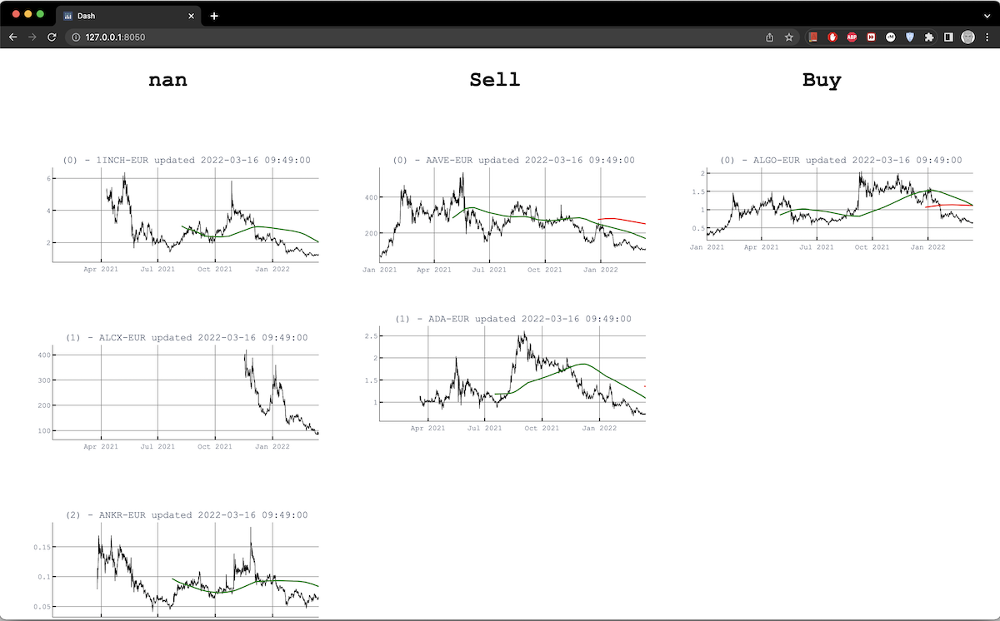

# A really simple Cryptobot

With this package you can

1) Connect to Coinbase to fetch data at regular intervals (1 hour), 
2) Run bots to generate "Buy" and "Sell" signals,
3) Display these using a simple Plotly dashboard.

The package features

### CoinTimeseries Class

Represents coin time-series and offers access methods. 
Not to be directly interfaced by users.

### Fetcher Class

Fetches serially new data from Coinbase servers and saves to local DB. It takes a bit of time the first time it runs.
`Fetcher` requires a `cred.yaml` file for authentication.

### Bot Class
Bots read regularly and in parallel local data to generate `Buy` and `Sell` decisions, which are also 
saved to the local DB. They assume that latest data points have already been fetched. Currently implemented a moving 
average bot. It generates a buy signal as soon as the small window moving average crosses the large window moving 
average signals.

### Local DB

This is currently a collection of .CSV files and fulfils the purpose.

### Logger

Fetchers and Bots generate in addition to printing proper log messages they also 
write to log files under `/log`.

    
## Requirements:
`Poetry version 1.1.11`

`Python >=3.7.6`

`pyenv 1.2.17-1-g89786b90`

`cred.yaml` to connect to CoinBase with the following keys `api_key`, `api_secret`, `passphrase`. 
    
## Installation

`make setup` to install Python environment.

## Running
Currently, there is no CLI implemented. 

`python Fetcher.py` to start the fetching process.
`python Bot.py` to start the moving average bot.

